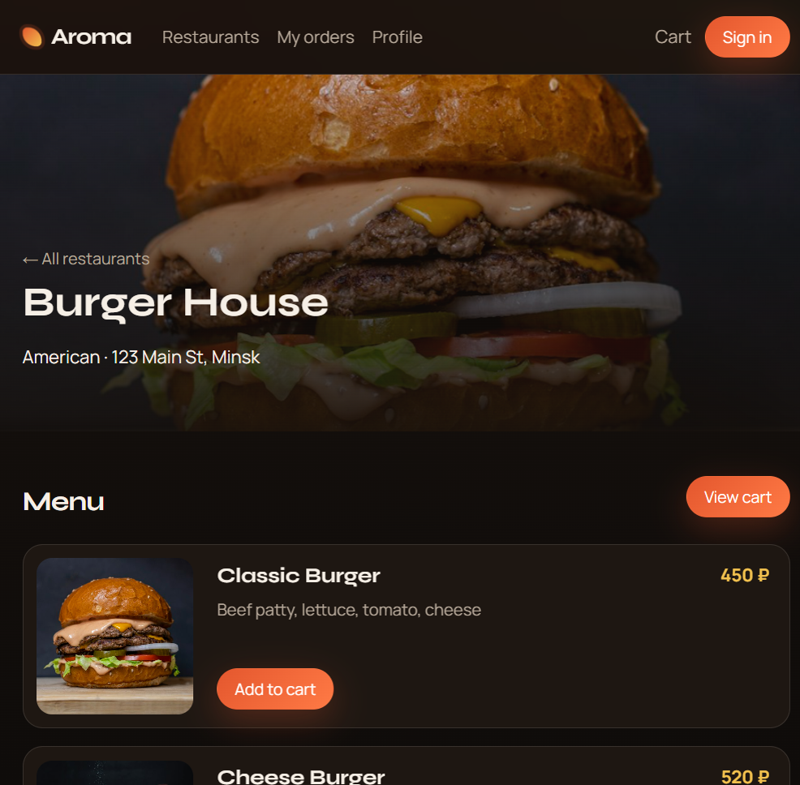
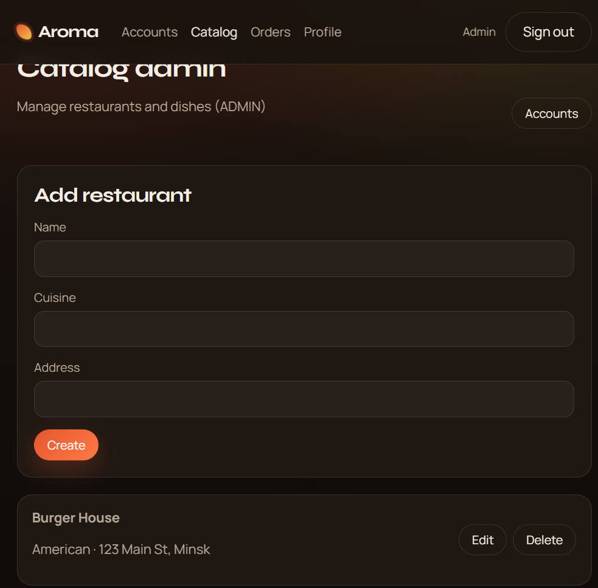
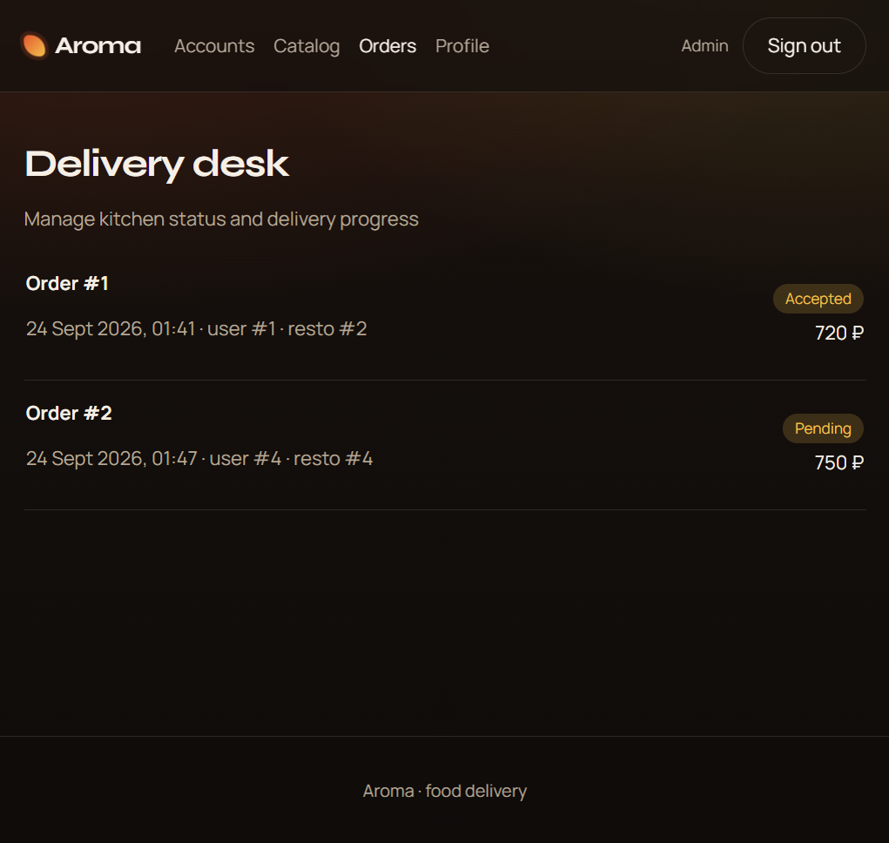

# Aroma Food Delivery — Backend

Microservices backend for the **Aroma** food platform: authentication, restaurant catalog, and orders.

Companion UI: [`react_fistapp`](https://github.com/top-secret666/react_fistapp)

### Live demo (frontend)

**https://reactfistapp.vercel.app** · [GitHub Pages](https://top-secret666.github.io/react_fistapp/)

<p align="center">
  
</p>

---

## Services

| Service | Port | Responsibility |
|---------|------|----------------|
| **user-service** | `8084` | Register / login / Google OAuth, JWT, profiles, roles, addresses |
| **restaurant-service** | `8081` | Restaurants, dishes, ratings |
| **order-service** | `8082` | Place orders, status lifecycle, payments |

```text
React SPA (:3000)
      │
      ├──► user-service        (:8084)
      ├──► restaurant-service  (:8081)
      └──► order-service       (:8082)
                │
                ├── HTTP ► user-service, restaurant-service
                └── Kafka ► restaurant-service   (full Docker stack only)
```

---

## Two ways to run

### A. Local mode (recommended for development)

No Docker, Postgres, Kafka, or Keycloak. Uses **H2** + **local JWT**.

```powershell
# Prerequisites: JDK 17 + Maven under food\.tools\apache-maven-3.9.6
.\start-local.ps1
```

| Endpoint | URL |
|----------|-----|
| user-service | http://localhost:8084 |
| restaurant-service | http://localhost:8081 |
| order-service | http://localhost:8082 |
| Swagger (each service) | `/swagger-ui/index.html` |
| Health | `GET /actuator/health` |

Then start the frontend:

```bash
cd ../react_fistapp
cp .env.example .env
npm install
npm start
```

Open http://localhost:3000

#### Demo accounts (password `aroma123`)

| Email | Roles | UI |
|-------|-------|-----|
| `user@aroma.app` | `USER` | Browse, cart, orders |
| `manager@aroma.app` | `USER` + `MANAGER` | Delivery desk |
| `admin@aroma.app` | `ADMIN` | Accounts + catalog |

#### Google sign-in (local)

1. Google Cloud Console → OAuth **Web application** client  
2. Authorized JavaScript origins: `http://localhost:3000`  
3. Same Client ID in:
   - `react_fistapp/.env` → `REACT_APP_GOOGLE_CLIENT_ID`
   - environment for user-service → `GOOGLE_CLIENT_ID` (set by `start-local.ps1` if unset)
4. Restart user-service and `npm start`

---

### B. Full stack (Docker Compose)

| Extra | URL |
|-------|-----|
| Keycloak | http://localhost:8080 |
| Mailhog | http://localhost:8025 |

Layout expected for frontend profile:

```text
parent/
  food/            ← this repository
  react_fistapp/   ← React SPA (sibling)
```

```bash
docker compose --profile all --profile frontend up -d --build
```

---

## Screenshots

| Home | Catalog |
|:----:|:-------:|
|  |  |

| Menu | Sign in |
|:----:|:-------:|
|  |  |

| Admin catalog | Accounts |
|:-------------:|:--------:|
|  |  |

| Delivery desk |
|:-------------:|
|  |

---

## Repository layout

```text
food/
├── user-service/          Spring Boot — auth & users
├── restaurant-service/    Spring Boot — catalog & dishes
├── order-service/         Spring Boot — orders & status
├── docs/
│   ├── screenshots/       README images
│   └── spec/              Technical specification PDFs
├── scripts/               Helper scripts (e.g. e2e)
├── docker-compose.yml
├── start-local.ps1        Local H2 + JWT launcher
├── .env.example
└── README.md
```

---

## Quick API smoke test (local)

```bash
# Login
curl -s -X POST http://localhost:8084/api/auth/login \
  -H "Content-Type: application/json" \
  -d "{\"email\":\"user@aroma.app\",\"password\":\"aroma123\"}"

# Catalog
curl -s http://localhost:8081/api/restaurants

# Place order (replace TOKEN)
curl -s -X POST http://localhost:8082/api/orders \
  -H "Authorization: Bearer TOKEN" \
  -H "Content-Type: application/json" \
  -d "{\"restaurantId\":1,\"paymentMethod\":\"CARD\",\"items\":[{\"dishId\":1,\"quantity\":2}]}"
```

Order status flow:

`PENDING` → `ACCEPTED` → `COOKING` → `READY_FOR_DELIVERY` → `DELIVERING` → `COMPLETED`

Managers/admins update status via `PUT /api/orders/{id}/status`.

---

## Configuration

| Variable | Purpose |
|----------|---------|
| `GOOGLE_CLIENT_ID` | Google Identity audience (local + Keycloak) |
| `GOOGLE_CLIENT_SECRET` | Keycloak Google IdP (Docker only) |
| `CORS_ALLOWED_ORIGINS` | Allowed frontend origins |
| `REQUIRE_EMAIL_VERIFIED` | Enforce verified email (Docker/Keycloak) |

---

## Tests

```bash
mvn -f user-service/pom.xml verify
mvn -f restaurant-service/pom.xml verify
mvn -f order-service/pom.xml verify
```

Integration tests use Testcontainers (Docker required).

---

## Spec

- [Technical specification](docs/spec/technical-specification.pdf)

---

## Author

Dana Stukalova
